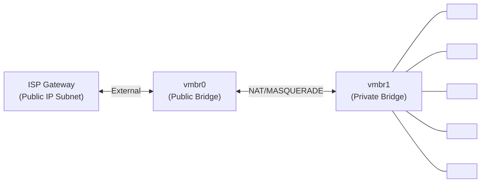
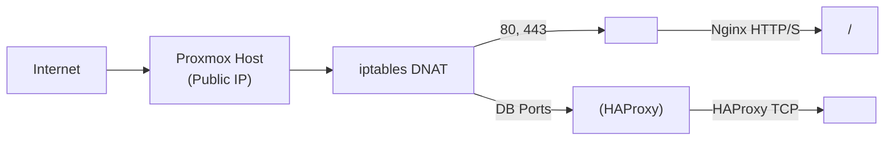

# Architecture & Networking

This document outlines the high-level architecture and network topology for a single-node Proxmox VE deployment serving containerized applications and databases.

## Virtual Machine Roles (Example Inventory)

A typical deployment leverages dedicated VMs for different roles:

| Role | Typical Resources | Purpose |
|------|-------------------|---------|
| **`<APP_VM>`** | Heavy CPU/RAM | Docker application host (microservices, frontend apps) |
| **`<DB_VM>`** | Modest CPU/RAM | Database host (PostgreSQL, MongoDB) |
| **`<PROXY_VM>`** | Low CPU/RAM | Reverse proxy (Nginx for HTTP/S, HAProxy for TCP) |
| **`<BUILD_VM>`** | High CPU/RAM | CI/CD Server (GitLab CE, Runners, Container Registry) |
| **`<MONITOR_VM>`**| Modest CPU/RAM | Observability stack (Prometheus, Grafana) |

## Network Topology Overview

The infrastructure relies on a **two-bridge** design using NAT to provide internet access to the private VM network.



### Bridge Details

| Bridge | Type | Ports | Purpose |
|--------|------|-------|---------|
| `vmbr0` | Public | Primary physical NIC (`nic0`) | Internet-facing bridge holding the host's public IP |
| `vmbr1` | Private | none | Internal VM communication bridge holding the private gateway IP (e.g., `<PRIVATE_GATEWAY_IP>`) |

- All VMs connect exclusively to `vmbr1`.
- `vmbr0` acts as the NAT gateway.

### Key Network Features

1. **NAT Masquerade:** Traffic from the private subnet (e.g., `<PRIVATE_SUBNET>/24`) is masqueraded to `vmbr0` for outbound internet access.
2. **DNAT Port Forwarding:** Public ports (80, 443, DB ports) are forwarded from the host's public IP to specific internal VMs.
3. **IP Forwarding:** Must be enabled on the host (`net.ipv4.ip_forward = 1`).
4. **MTU Clamping:** MSS clamping is often required to prevent MTU blackholes.

## Port Forwarding & NAT (iptables)

Traffic is routed using iptables rules on the Proxmox host. 

### Traffic Flow Example



### Example NAT Rules (iptables)

**PREROUTING Chain (DNAT):**
```bash
iptables -t nat -A PREROUTING -p tcp --dport 80 -j DNAT --to-destination <PROXY_VM_IP>:80
iptables -t nat -A PREROUTING -p tcp --dport 443 -j DNAT --to-destination <PROXY_VM_IP>:443
iptables -t nat -A PREROUTING -p tcp --dport 5432 -j DNAT --to-destination <PROXY_VM_IP>:5432
```

**POSTROUTING Chain (MASQUERADE):**
```bash
iptables -t nat -A POSTROUTING -s <PRIVATE_SUBNET>/24 -o vmbr0 -j MASQUERADE
```

### MTU Clamping (Mangle Rules)

To prevent issues with non-standard MTU sizes upstream, apply MSS clamping via iptables:
```bash
iptables -t mangle -A PREROUTING -p tcp -m tcp --tcp-flags SYN,RST SYN -j TCPMSS --set-mss 1360
iptables -t mangle -A OUTPUT -p tcp -m tcp --tcp-flags SYN,RST SYN -j TCPMSS --set-mss 1360
iptables -t mangle -A FORWARD -p tcp -m tcp --tcp-flags SYN,RST SYN -j TCPMSS --clamp-mss-to-pmtu
iptables -t mangle -A POSTROUTING -o vmbr0 -p tcp -m tcp --tcp-flags SYN,RST SYN -j TCPMSS --clamp-mss-to-pmtu
```

Ensure rules are persisted across reboots using `netfilter-persistent` or equivalent.

## Firewall Configuration

### Security Posture

Relying entirely on NAT for security is considered a **permissive** posture. While NAT prevents direct inbound access to most ports, any port explicitly DNAT'd is exposed. 

**Critical Considerations:**
- **Exposed Databases**: DNATing database ports (e.g., PostgreSQL `5432`, MongoDB `27017`) directly to the public internet relies solely on the database's authentication mechanism.
- **Docker Interactions**: Docker manages its own iptables chains inside the VMs. UFW on the VM may conflict with Docker or be bypassed by it.

### Recommended Security Enhancements

1. **Enable PVE Firewall**: Apply restrictive rules at the Proxmox Datacenter/Node level.
2. **Restrict Port Forwarding**: If exposing databases is necessary, restrict the iptables DNAT rules to specific known source IPs (`-s <TRUSTED_IP>`).
3. **Fail2ban**: Deploy `fail2ban` on the Proxmox host and any VM exposing SSH.
4. **VPN Access**: Instead of exposing SSH or database ports, deploy a WireGuard or OpenVPN container/VM, and require a VPN connection for administrative access.
